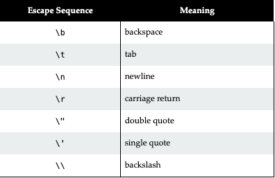

# Data and Expressions

### Character Strings
Strings are objects in Java. (string literals are denoted with double quotes " ")  
they do not span multiple lines. 

Numbers are automatically converted to strings when trying to concatenate with another string.  
To perform arithmetic operations within a string literal. Parenthesis () are required.

Escape sequences represent special characters to be used within a string.  Denoted with a \

[HTML only works in this document because of intelli idea]: #

 

### Variables 

variables declared with final are values that can not be changed.  

You can declare multiple variables within the same line of the same data type.  

    int i ,j = 0;

### Dictionary
Parameter - A value that is passed within a method. Answer(Score){}