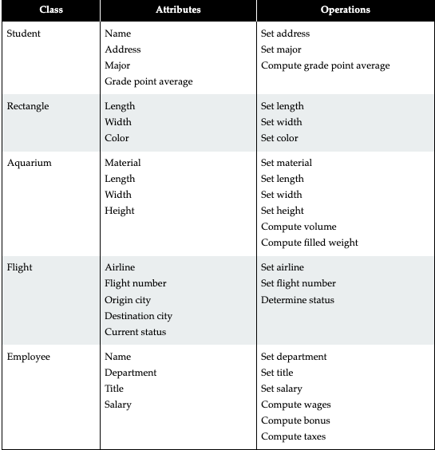

### Java Class General Idea  
What the Object is(Person,Place,Thing), what its Attributes are (Variables and their types),  
and either setting those attributes or performing operations with them.  

Data (Primitive) is Declared towards the top of a class, such as int, strings, doubles chrs  

Methods of the class are created after these are  like services (Setting, Getting, Converting Types).